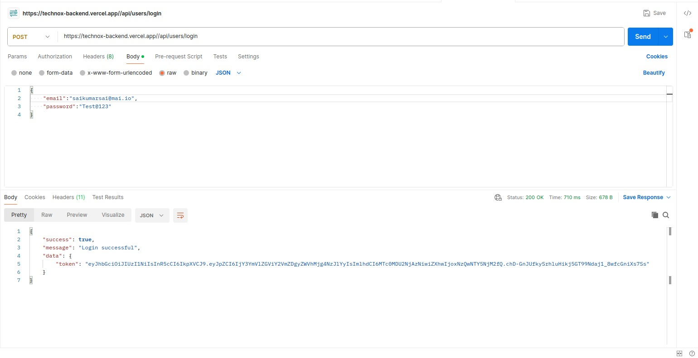
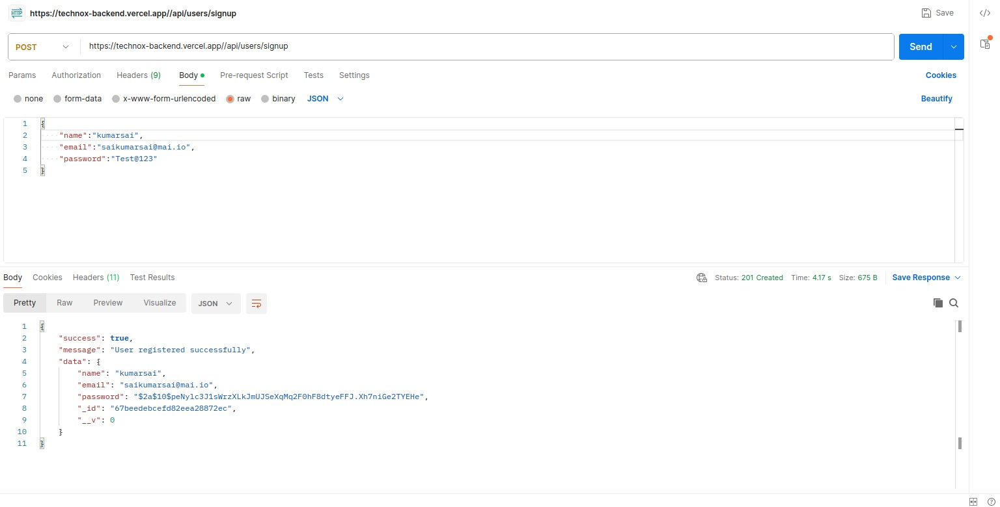
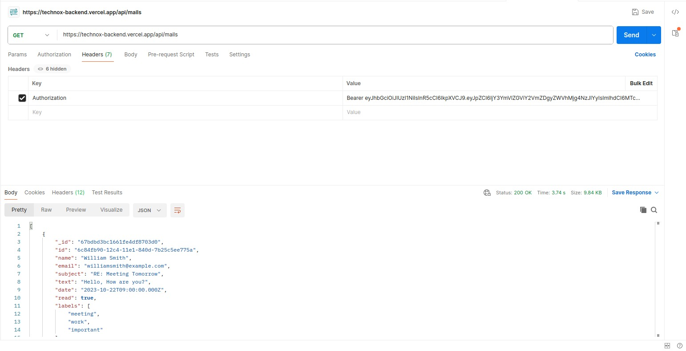
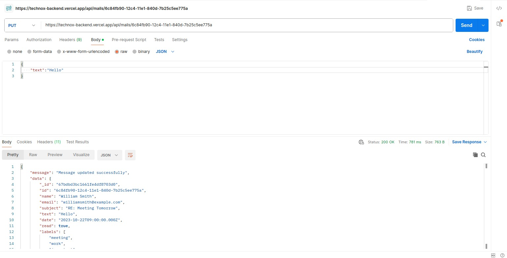

# 🛠 Mailing Dashboard - Backend

This is the backend for the Mailing Dashboard assignment, built using **Node.js and Express**. It provides authentication and mock email data for the frontend.

## 🚀 Live Backend (If Deployed)

[Live API Link](https://technox-backend.vercel.app)

---

## 🔧 **Setup Instructions**

### **1. Clone the repository**

```sh
git clone https://github.com/Samanth612/mail-dashboard-backend
cd mail-dashboard-backend
```

### **2. Install dependencies**

```sh
npm install
```

### **3. Set up environment variables**

Create a `.env` file in the root directory and add:

```env
PORT=5000
JWT_SECRET=your_secret_key
MONGO_URI=your_mongo_uri
```

### **4. Start the server**

```sh
npm start
```

The backend will run on `http://localhost:8080/`.

---

## 🏠 **Project Overview**

This backend provides:

1. **Authentication API** (JWT-based)

   - `/api/users/signup` - Create a new user
   - `/api/users/login` - Authenticate user and return a JWT token

2. **Mock Email Data API**

   - `/api/mails` - Returns a list of inbox emails
   - `/api/mails/:id` - Returns a updated email
   - `/api/mails/:id` - Return deleted email

3. **Middleware for JWT Authentication**
   - Protects API routes that require authentication.

---

## 🤔 **Assumptions Made**

- **User authentication is handled via JWT** and stored in local storage on the frontend.
- **Mock email data is used** from mongoDB database.

---

## 🖼 **Screenshots**






---

## 🐛 **Tech Stack**

- **Node.js + Express**
- **JWT for Authentication**
- **Mock Data (pushed to MongoDB Database)**
- **dotenv for environment variables**
- **CORS enabled for frontend communication**

---
